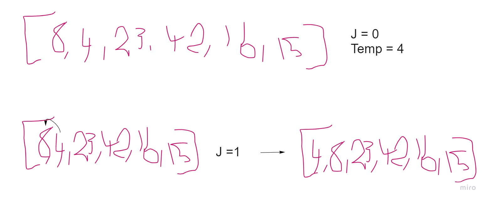
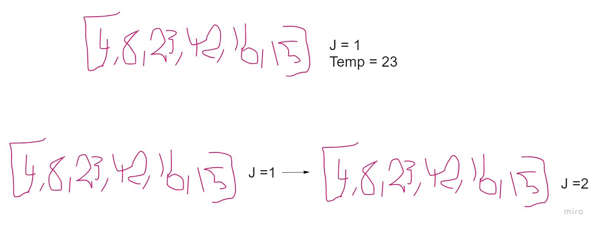
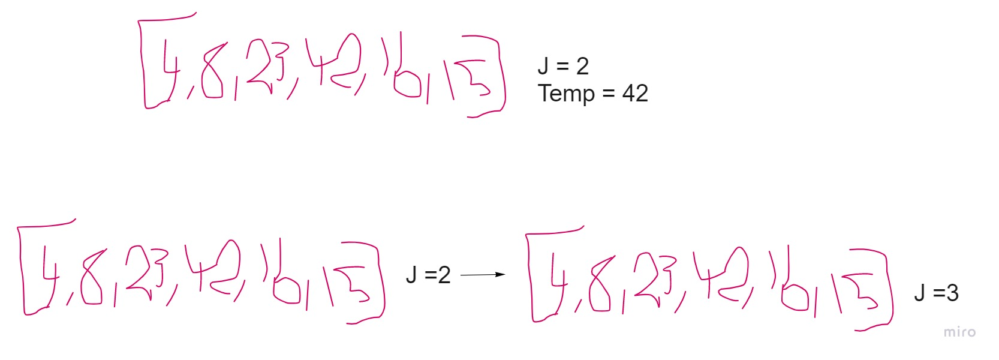
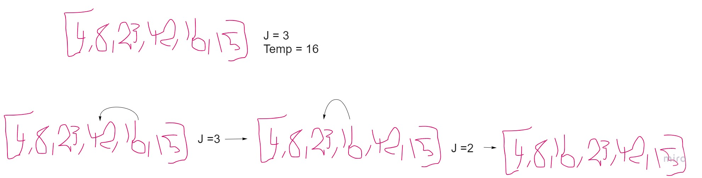
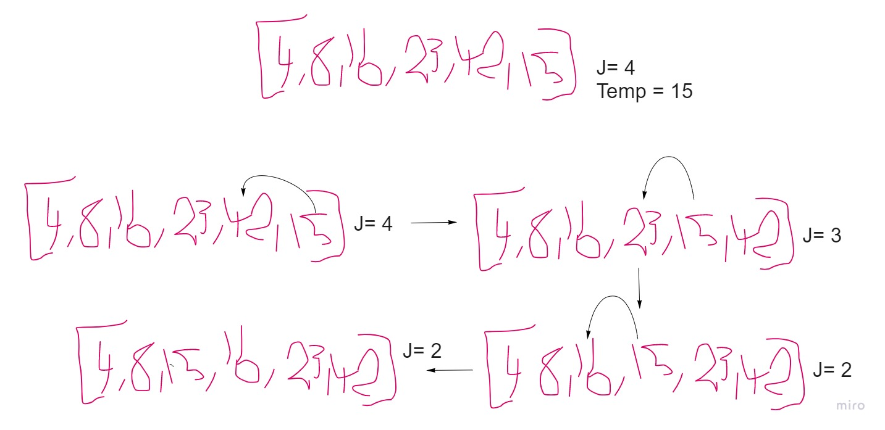

# Insertion Sort

Insertion sort is a simple sorting algorithm that builds the final sorted array (or list) one item at a time. It is much less efficient on large lists than more advanced algorithms such as quicksort, heapsort, or merge sort. However, insertion sort provides several advantages:

Simple implementation: Jon Bentley shows a three-line C++ version, and a five-line optimized version
Efficient for (quite) small data sets, much like other quadratic sorting algorithms
More efficient in practice than most other simple quadratic (i.e., O(n2)) algorithms such as selection sort or bubble sort
Adaptive, i.e., efficient for data sets that are already substantially sorted: the time complexity is O(kn) when each element in the input is no more than k places away from its sorted position
Stable; i.e., does not change the relative order of elements with equal keys
In-place; i.e., only requires a constant amount O(1) of additional memory space
Online; i.e., can sort a list as it receives it
When people manually sort cards in a bridge hand, most use a method that is similar to insertion sort.

## Pseudo code

> InsertionSort(int[] arr)
>
> FOR i = 1 to arr.length
>
>      int j <-- i - 1
>      int temp <-- arr[i]
>
>      WHILE j >= 0 AND temp < arr[j]
>        arr[j + 1] <-- arr[j]
>        j <-- j - 1
>
>      arr[j + 1] <-- temp

  
  

## Tracing the algorithm

- first iteration

Input array ==> [8,4,23,42,16,15]

In the first iteration, we start with the second index of the array and check if there was any number higher than it from the index before it and if there was a number higher, we will move it one step behind that number.

- Second iteration

In the second iteration, index = 2 is higher than the number at the index before it, so the array remains unchanged.

- Third itteration

In the third iteration, index = 3 is higher than the the number at the index before it, so the array remains unchanged.

- Fourth itteration

In the fourth Iteration, index = 4 is lees than the number at the prev index, so we will switch the two entries, then check the if the number at the previous index as well which is less than the one we started with so we move it backwards another further position.

- Fifth itteration

In the fifth and final iteration, we check the entry at index 5 with all of the previous indices before, and move it back each time the prev index value is higher than it.

## Efficency

-Time complexity: O(n^2) ==> Multiple loops in different iterations. 
-Space complexity: Only requires a constant amount O(1) of additional memory space
