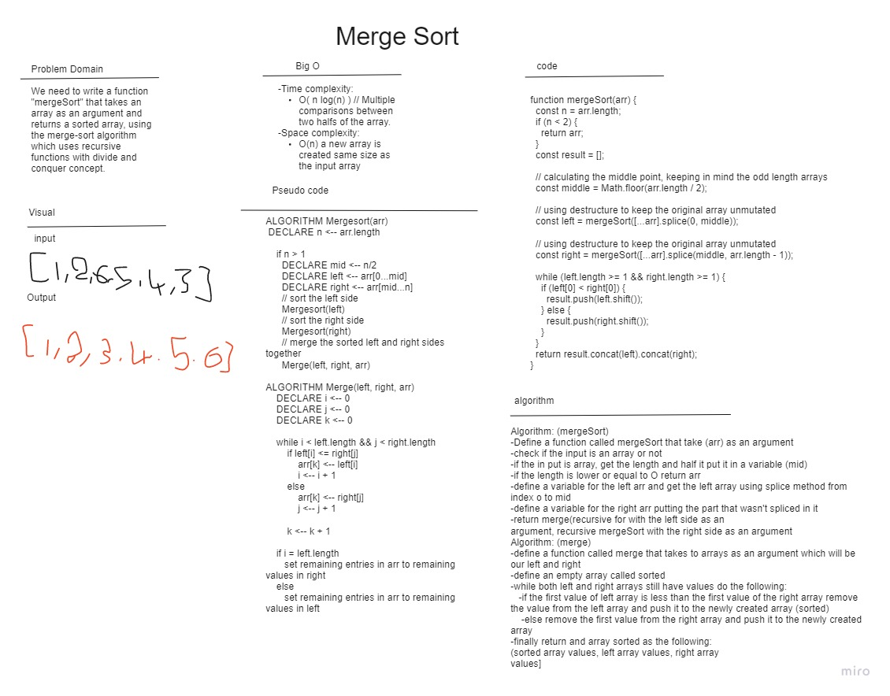

# Merge Sort

### Challange Summary

The merge sort is one of the more advanced sorting algorithms that’s quite efficient in sorting large amounts of data. The algorithm uses the recursive function concept with divide and conquer strategy to efficiently sort a given list of elements.

Please click on the following link to read a more detailed [blog](./Blog.md) article about this subject.

## Whiteboard

