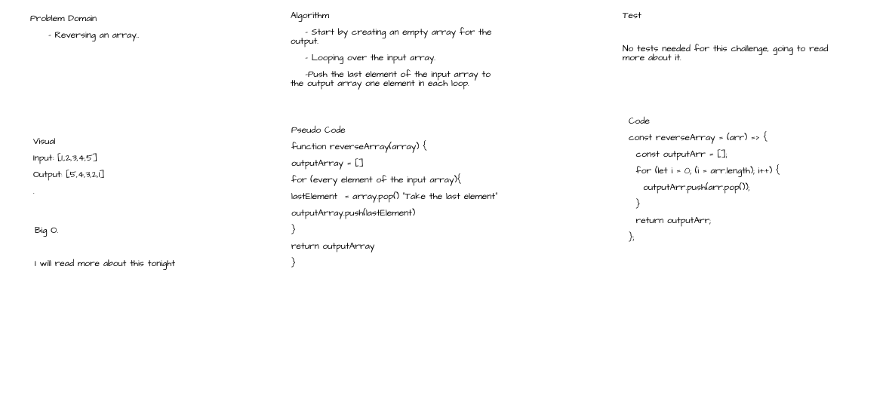

# Reversed Array Coding Challenge

## Whiteboard Process

## Approach & Efficiency

First I created an empty array for the output,I used a simple for loop covering the full length of the input array, then in each iteration of the loop, I used arr.pop() method to push the last element to the output array.
