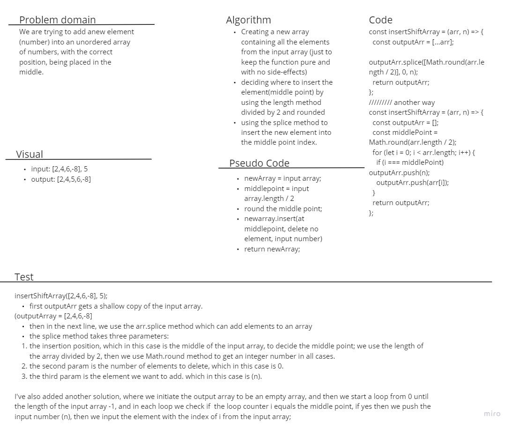

# Array Insert Shift Coding Challenge

## Whiteboard Process

## Approach & Efficiency

in this Algorithm, I've used to methods, the first is using the array.prototype.splice method, which in this case will insert the number at the middle position
the next way for the solution was by creating an empty array, a for loop that goes until the length of the array -1, and in each loop we check if the counter has reached the middle point to add the input number n, and we push the current element in all cases after the check.

[Table of content](../../../README.md)
