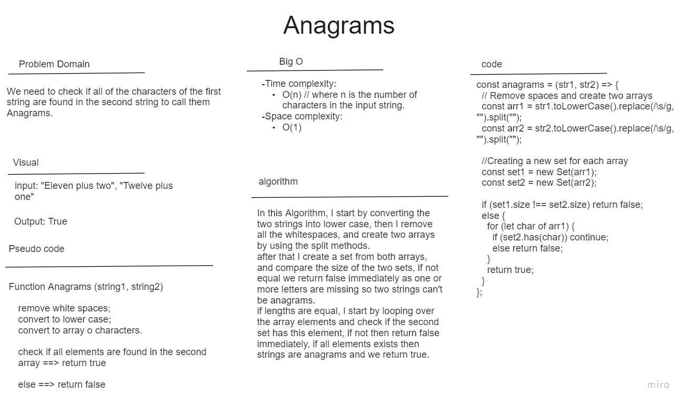

# Anagrams

in this challenge we want to check if all of the characters of the first string are found in the second string to call them Anagrams.

Below you can find the whiteboard for this challenge including the effeciency and the actual algorirthm.

