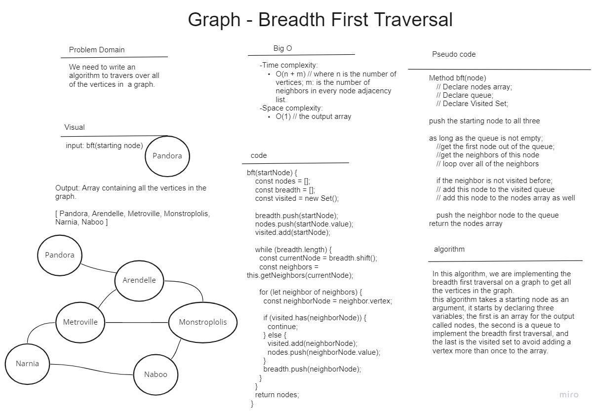

# Graph-Breadth-First

In this algorithm, we are implementing the breadth first traversal on a graph to get all the vertices in the graph.
this algorithm takes a starting node as an argument, it starts by declaring three variables; the first is an array for the output called nodes, the second is a queue to implement the breadth first traversal, and the last is the visited set to avoid adding a vertex more than once to the array.

Below, you can check the whiteboard drawing for this algorithm

