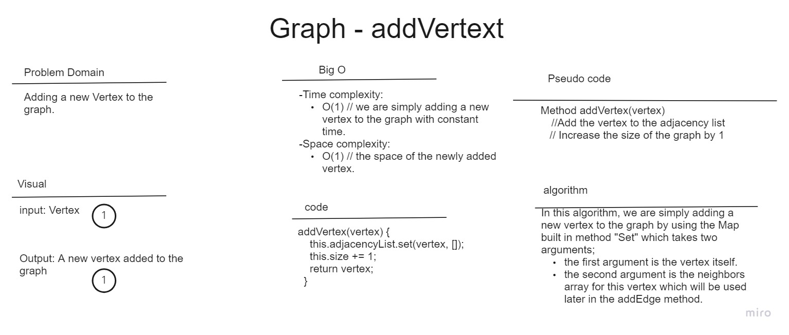
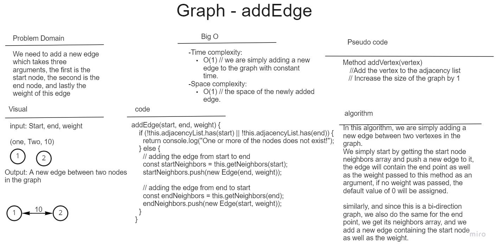
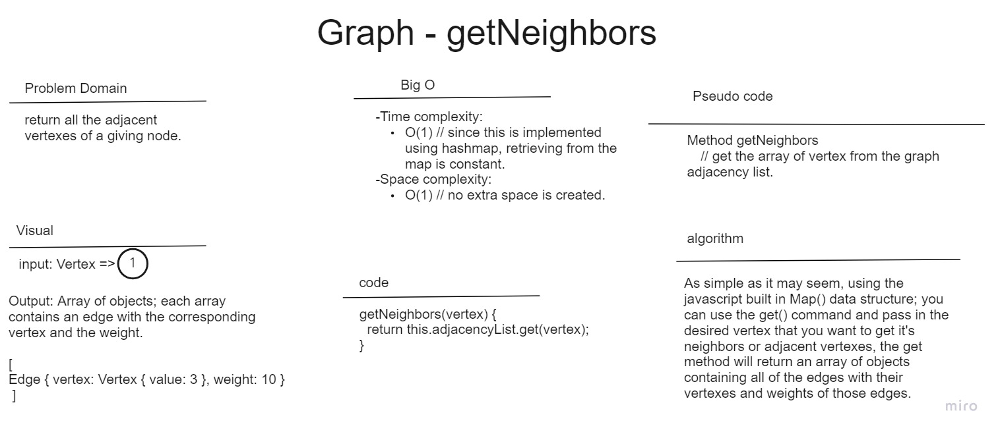
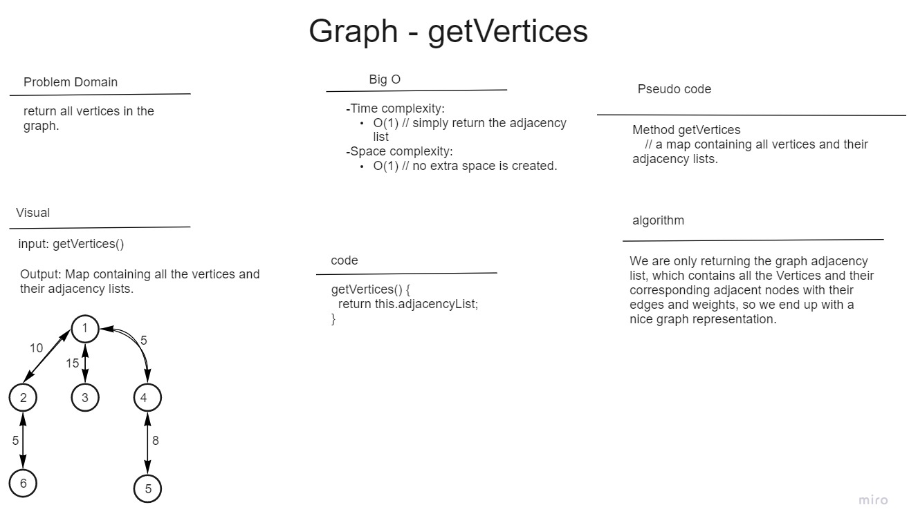

# graph

## Challenge Type: New Implementation

The graph is a non-linear data structure that stores nodes (vertexes) and the edges or adjacent nodes connected to it.

In this challenge we are implementing the graph using a map for the adjacency list.

Below you will find the whiteboard image for this coding challenge as well as the efficiency for each of the methods implemented.

### 1. Add a node (Vertex) to the graph

### 2. Adding an edge

### 3. getNeighbors

### 4. getVertexes

## 37 Business trip whiteboard

