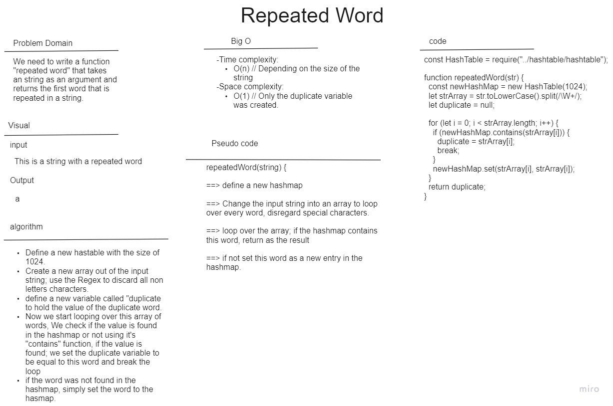

# Repeated Word

In this function, We want to return the first word that is repeated in a string using the hash map functions.

I have implemented this solution using a the set and the contains functions of the hashmap which were already implemented in the previous code challenge.

Below you can find the whiteboard for this code challange:

## Efficiency

#### Time complexity:

- O(n) // Depending on the size of the string

#### Space complexity:

- O(1) // Only the duplicate variable was created.
