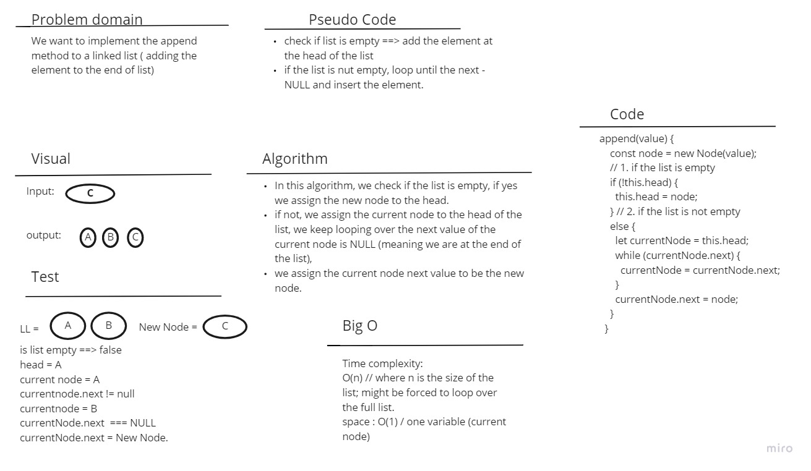

# Singly Linked List - insertion

A single linked list is the simplest form of the linked list data structure. it stores data in a list which does not need to be stored in contiguous locations in the memory, inserting and retreiving data from the list is much easier and faster, and it can easly be scalled up or down holding as much data as needed.

## Challenge

In this challenge, I have implemented a linked list along with a set of tests for it.

## Approach & Efficiency

I have implemented the linked list in a Class approach, where each of the list method is a method of the class, creating a new linked list is simply creating a new instance of the class.

## API

1. append(value) : used to add a new node to the end of the list with the value passed to this method.
    Big O: => time complexity => O(n) // we want to loop over all the list nodes. 
   space => O(1) // only one variable created

   

2. insertBefore(newValue, target) : used to insert a new node before an existing node, we loop over until the current node next value is the target node to insert before, then we insert the new node before it
    Big O: => time complexity => O(n) // we might need to loop over all the list nodes if we want to insert before the last element. 
   space => O(1) // only one variable created

   

3. isertAfter(newValue, target) : used to insert a new node after an existing node, we loop over until the current node value is the target node to insert after it, then we insert the new node there.
    Big O: => time complexity => O(n) // we might need to loop over all the list nodes if we want to insert after the last element. 
   space => O(1) // only one variable created

   
