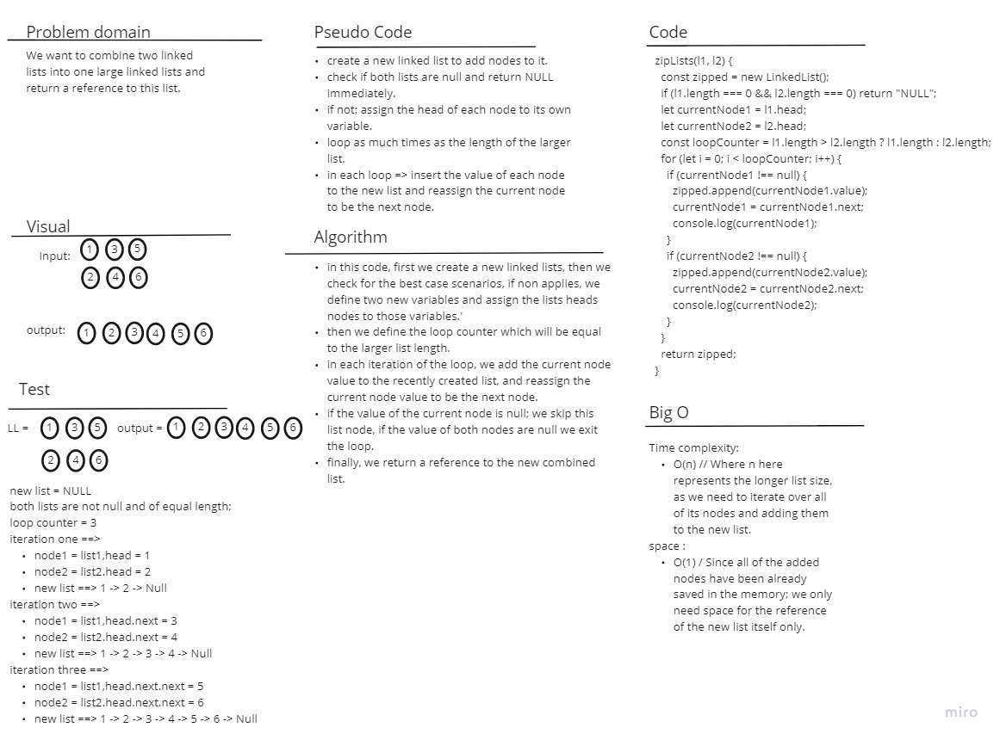
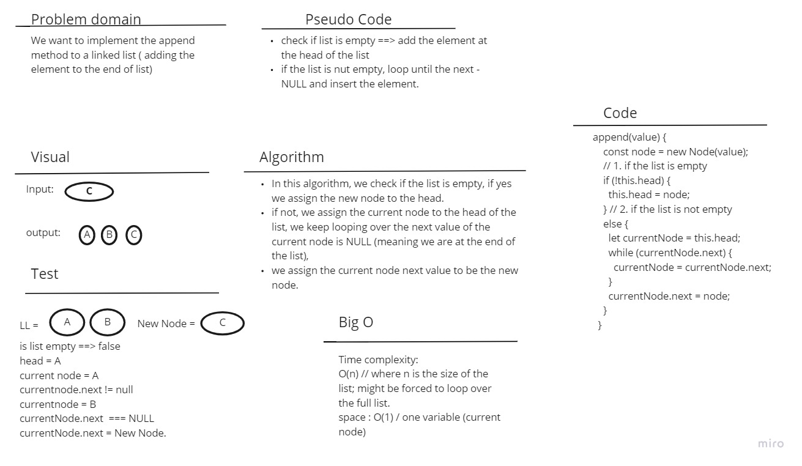

# Linked List zip

A single linked list is the simplest form of the linked list data structure. it stores data in a list which do not need to be stored in contiguous locations in the memory, inserting and retreiving data from the list is much easier and faster, and it can easly be scalled up or down holding as much data as needed.

## Challenge

In this challenge, I wrote a new method for the single linked list to compain two linked lists nodes by itteration into one single list containing all the nodes from the two lists passed to this function as arguments.

## Approach & Efficiency

I defined two variables and one new linked list inside this method definition, assigned each list head as the value for each one of the variables and used a for loop to append all non null nodes to the newely created linked list.

## API

1. zipLists(list1, list2) : to get all the node values from the two lists into one large linked list, and returning a reference to this new list.
    Big O: => time complexity => O(n) // Where n here represents the longer list size, as we need to itterate over all of its nodes and adding them to the new list.
   space => O(1) // Since all of the added nodes have been already saved in the memory; we only need space for the reference of the new list itself only.
   

2. append(value) : used to add a new node to the end of the list with the value passed to this method.
    Big O: => time complexity => O(n) // we want to loop over all the list nodes. 
   space => O(1) // only one variable created

   
