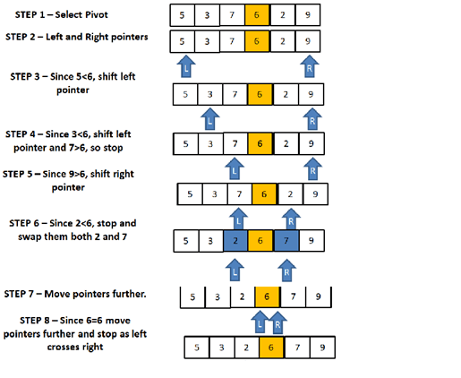

# Quick Sort

QuickSort is a Divide and Conquer algorithm. It picks an element as pivot and partitions the given array around the picked pivot. There are many different versions of quickSort that pick pivot in different ways.

1. Always pick first element as pivot.
2. Always pick last element as pivot (implemented below)
3. Pick a random element as pivot.
4. Pick median as pivot.

The key process in quickSort is partition(). Target of partitions is, given an array and an element x of array as pivot, put x at its correct position in sorted array and put all smaller elements (smaller than x) before x, and put all greater elements (greater than x) after x. All this should be done in linear time.

## Pseudo Code

> ALGORITHM QuickSort(arr, left, right) 
> if left < right 
> // Partition the array by setting the position of the pivot value 
> DEFINE position <-- Partition(arr, left, right) 
> // Sort the left 
> QuickSort(arr, left, position - 1) 
> // Sort the right 
> QuickSort(arr, position + 1, right)  > 
> ALGORITHM Partition(arr, left, right) 
> // set a pivot value as a point of reference 
> DEFINE pivot <-- arr[right] 
> // create a variable to track the largest index of numbers lower than the defined pivot  > 
> DEFINE low <-- left - 1 
> for i <- left to right do 
> if arr[i] <= pivot 
> low++ 
> Swap(arr, i, low)  > 
> // place the value of the pivot location in the middle. 
> // all numbers smaller than the pivot are on the left, larger on the right. 
> Swap(arr, right, low + 1) 
>
> // return the pivot index point  
> return low + 1  > 
> ALGORITHM Swap(arr, i, low) 
> DEFINE temp; 
> temp <-- arr[i] 
> arr[i] <-- arr[low] 
> arr[low] <-- temp 

## Tracing

## Step by step tracing

1. First find the “pivot” element in the array.
2. Start the left pointer at first element of the array.
3. Start the right pointer at last element of the array.
4. Compare the element pointing with left pointer and if it is less than the pivot element, then move the left pointer to the right (add 1 to the left index). Continue this until left side element is greater than or equal to the pivot element.
5. Compare the element pointing with right pointer and if it is greater than the pivot element, then move the right pointer to the left (subtract 1 to the right index). Continue this until right side element is less than or equal to the pivot element.
6. Check if left pointer is less than or equal to right pointer, then swap the elements in locations of these pointers.
7. Increment the left pointer and decrement the right pointer.
8. If index of left pointer is still less than the index of the right pointer, then repeat the process; else return the index of the left pointer.

So, let us see these steps with an example. Let us consider array of elements which we need to sort is [5,3,7,6,2,9].

## Determine Pivot element

But before going forward with the Quick sort, selecting the pivot element plays a major role. If you select the first element as the pivot element, then it gives worst performance in the sorted array. So, it is always advisable to pick the middle element (length of the array divided by 2) as the pivot element and we do the same.

Here are the steps to perform Quick sort that is being shown with an example [5,3,7,6,2,9].

### STEP 1:

Determine pivot as middle element. So, 7 is the pivot element.

### STEP 2:

Start left and right pointers as first and last elements of the array respectively. So, left pointer is pointing to 5 at index 0 and right pointer is pointing to 9 at index 5.

### STEP 3:

Compare element at the left pointer with the pivot element. Since, 5 < 6 shift left pointer to the right to index 1.

### STEP 4:

Now, still 3 <6 so shift left pointer to one more index to the right. So now 7 > 6 stop incrementing the left pointer and now left pointer is at index 2.

### STEP 5:

Now, compare value at the right pointer with the pivot element. Since 9 > 6 move the right pointer to the left. Now as 2 < 6 stop moving the right pointer.

### STEP 6:

Swap both values present at left and right pointers with each other.

### STEP 7:

Move both pointers one more step.

### STEP 8:

Since 6 = 6, move pointers to one more step and stop as left pointer crosses the right pointer and return the index of the left pointer.

So, here based on the above approach, we need to write code for swapping elements and partitioning the array as mentioned in above steps.

## Efficiency

-Time complexity: 
O( n log(n) ) // Multiple comparisons between two halfs of the array. 
-Space complexity: 
O(log(n)) In-place sorting means no additional storage space is used to perform sorting (except recursion stack)
