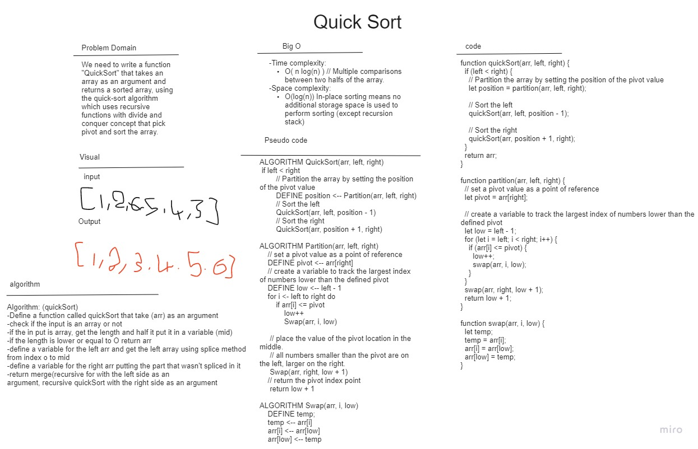

# Quick Sort

## Challenge summary

QuickSort is a Divide and Conquer algorithm. It picks an element as pivot and partitions the given array around the picked pivot. There are many different versions of quickSort that pick pivot in different ways.

Please click on the following link to read a more detailed [blog](./Blog.md) article about this subject.

## Whiteboard

## Efficiency

-Time complexity: 
O( n log(n) ) // Multiple comparisons between two halfs of the array. 
-Space complexity: 
O(log(n)) In-place sorting means no additional storage space is used to perform sorting (except recursion stack)
