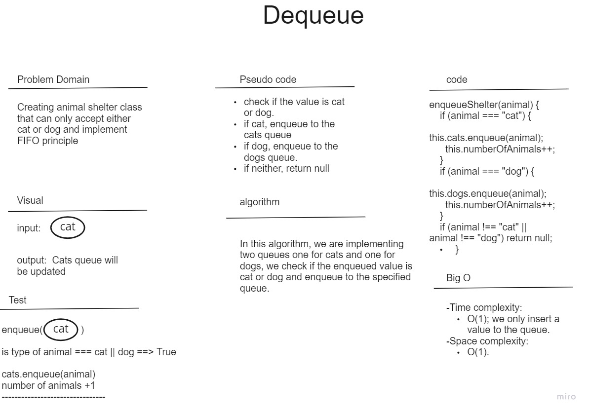
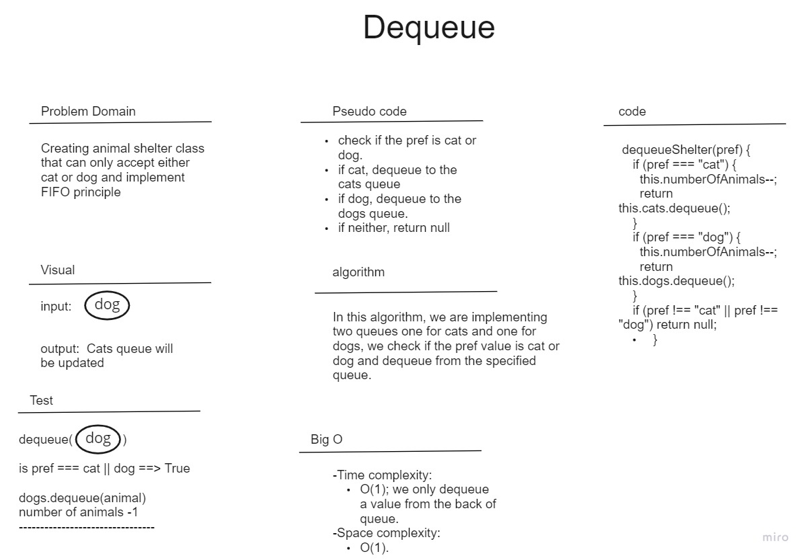

# stack-queue-animal-shelter

In this challenge, I've created a class called AnimalShelter, which has two queues, this class will only accept animals if they were Dogs or cats.
the storage for each of the animals has been implemented using queues. This shelter class has two methods, enqueue and dequeue, if the animal enqueued is neither a dog or a cat; the return value will be null. The dequeue method also has a preference to what will be dequeued, if the pref value is neither a dog or a cat; the dequeue will also return null.

below you can find the whiteboard for both of the methods:

### Enqueue

### Dequeue

---

[Table of content](../../../README.md)
