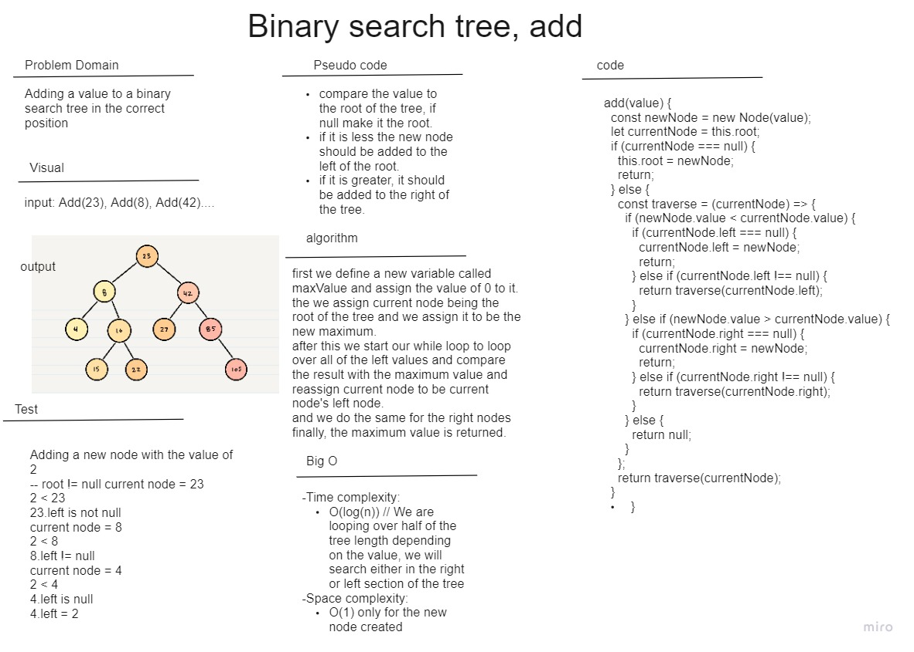
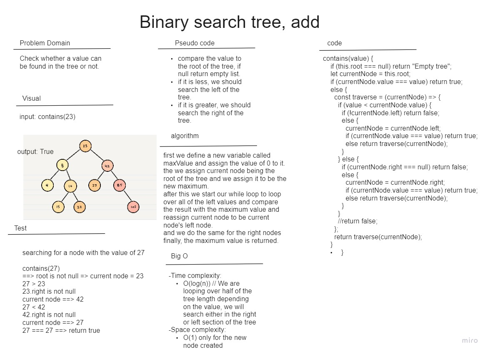

# trees

In this code challenge, I have implemented a binary tree and a binary search tree.
The binary search tree is a sub class derived from the binary tree class, meaning it has all of its original methods plus two new methods, the first method is the add, which takes a value as an argument and decides where it should be added in the tree, the second method is the contains, which returns a boolean for whether the tree contains a value or not.

I have used recursion in both of the methods of the subclass as well as for the main binary tree class treaversing methods.

## Big O Analysis

1. ### Add(value) ==> returns null

    Big O: => time complexity => O(log(n)) // We are looping over half of the tree length depending on the value, we will search either in the right or left section of the tree. 

   space => O(1) // the space of the new node was the only thing saved in the memory.

2. ### contains(value) ==> returns Boolean

    Big O: => time complexity => O(log(n)) // We are looping over half of the tree length depending on the value, we will serch eather in the right or left section of the tree. 

   space => O(1) // constant as we only created a current node tracking variable in the memory.
   
